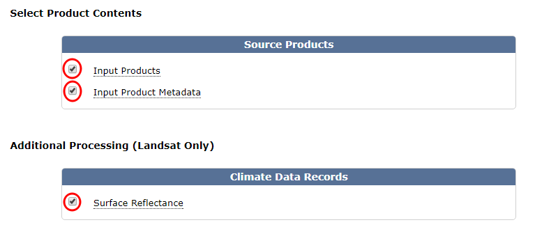
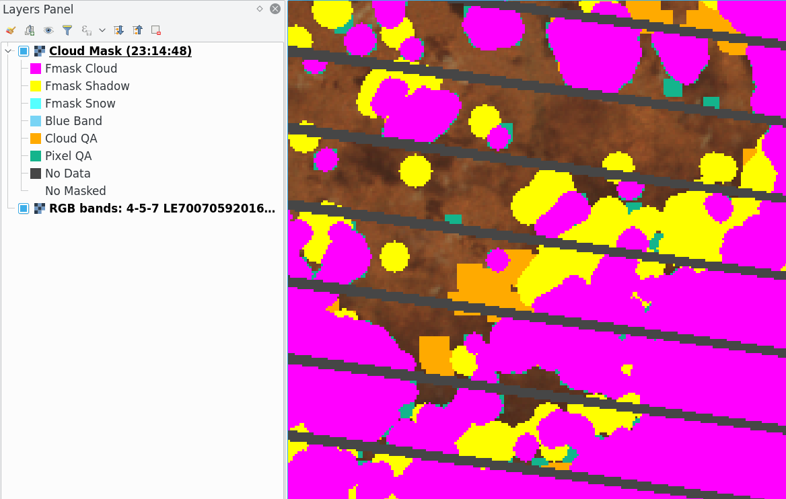
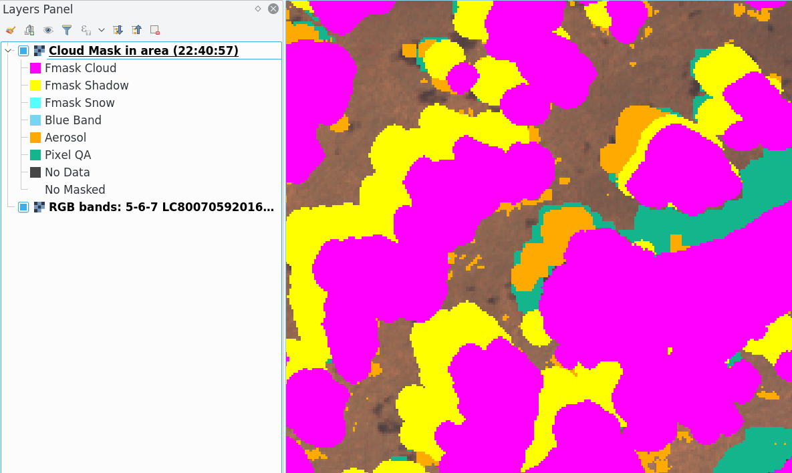

# CloudMasking

CloudMasking is a Qgis plugin for make the masking of clouds, cloud shadow, cirrus, aerosols, ice/snow and water for Landsat (4, 5, 7 and 8) products using different process and filters such as Fmask, Blue Band, Cloud QA, Aerosol and Pixel QA.

1. [Support landsat products](#support-landsat-products)
2. [Work flow](#work-flow)
3. [Cloud filters](#cloud-filters)

## Support landsat products

This plugin support two product types of landsat:

### 1. Level-1 Data Products (raw)

This is a raw Landsat products that can be downloaded from USGS in [EarthExplorer](https://earthexplorer.usgs.gov/). With that product the plugin only can make the cloud masking using fmask and/or blue-band (see more in [Cloud Filters](cloud_filters.md)).

### 2. Higher-Level Data Products (ESPA)

It have more processed Landsat products with more bands to be make the quality control and masking, that can be downloaded from [ESPA](https://espa.cr.usgs.gov/ordering/now). With that product the plugin can make the cloud masking using all filters (see more in [Cloud Filters](cloud_filters.md)).

!!! note "Important!"
    When you're downloading the images from the form on the ESPA page, with the Surface Reflectance you also need to download the input products and metadata:
    

## Work flow

The plugin is divided and ordered by three sections; `(1) Open and Load` this is for open the MTL file and load the stack, `(2) Filters and Mask` for enable and configure the filters for apply cloud masking and `(3) Apply and Save` for save the mask and apply the mask to stack:

### 1a. Browse and load the MTL file

The fists step you need to load a MTL file, click in `Browse` and `Load` for read the MTL file, when the MTL file is loaded the others widgets of the plugin is activated for use:

### 1b. Load stacks (optional)

The `Load stacks` section you can make and open in Qgis the stack in RGB bands combination as you want for visualize and check the Landsat image, in the right side you can access for special stacks (more uses) RBG bands order, you need to do click in `Load stack` bottom for make and load the stack configured. This is not necessary for process only for view:

### 2a. Select the filters to apply

The plugin have a four different filters to apply, the `Fmask` and `Blue Band` are available for all Landsat, but the `Cloud QA` and `Pixel QA` are available for only SR Landsat collection (see more in [Cloud Filters](cloud_filters.md)). You can activate more than one filter at a time, the plugin accumulate the filters in the same order (bottom up).

Please see the [cloud filters](cloud_filters.md) for more information about it.

### 2b. Generate the cloud mask

In this section you can generate the mask with the filters enabled, there are three options for generate the mask:

- `In the whole image` (by default) if the two options _selected in area_ and _shape area_ are disabled, the mask will process in whole image

- `In only selected area` (optional) if you selected this option you can process the mask in a specific area selected drawing in the canvas (only a rectangle area)

    - If the option `Keep the original image size` is enabled, the result mask will be with the same extent, else the result mask will be clipping in the area selected

- `In only shape area` (optional) with this option you can process the mask only inside the particular shape, you need create it before apply

    - If the option `Delete data outside the shape` is enabled, the result mask will have the same extent but the data outside the sahep will be masked, else the result mask will have the same and the data outside the shape will be valid (only masked inside the shape)

!!! warning "Only for Fmask process"
    Some statistics in fmask process are affected by size image, then if you are applying the fmask in a *selected area* or *shape area* the results could have small differences respect to apply *in the whole image*

### 3a. Select the mask to apply

In this section you must select the mask to apply or save it, there are two checkbox for help to find the mask in the list: `Only activated layers` and `Only mask layers`. You can save the mask selected with the button `Save mask`

### 3b. Apply mask

The plugin help for make, apply and save the stacks with the Landsat loaded, there are three options for which stack will be used for apply the mask:

- `Raw Bands`, these are the original bands of the Landsat products, you can select the order band for make the stack, by default are the reflectance bands

- `SR Bands`, these are the Surface Reflectance (SR) Landsat products by ESPA, this option is enable only if you are processing this type of product, and you can select the order band for make the stack, by default are the reflectance bands

- `Particular file`, the last option is apply to a particular stack or image file

Finally you must the select the output file to save and `Apply mask`

## Cloud filters

There are available four filters in the plugin, depend of the Landsat version or collection that you can use all of this filters. When you active more than one filter, the masking is accumulate from back to top (from Pixel QA to Fmask) and in this case some filters are cover by others (this is that one pixel is market with more than one filter)

**Filters available for Landsat 4, 5 and 7:**

* Fmask
* Blue Band
* Cloud QA (ESPA files)
* Pixel QA (ESPA files)

**Filters available for Landsat 8:**

* Fmask
* Blue Band
* Aerosol (ESPA files)
* Pixel QA (+cirrus) (ESPA files)

!!! warning "For Old ESPA version"
    If you want masking for old ESPA version, this plugin continue developing in branch repository, see [installation](installation.md#espa-format-version) for more information about it.

**Pixel values for the cloud mask:**

| Mask         | Pixel Value | Available for                  |
|:-------------|:------------|:-------------------------------|
| Fmask Cloud  | 2           | Raw and ESPA (Landsat 4,5,7,8) |
| Fmask Shadow | 3           | Raw and ESPA (Landsat 4,5,7,8) |
| Fmask Snow   | 4           | Raw and ESPA (Landsat 4,5,7,8) |
| Fmask Water  | 5           | Raw and ESPA (Landsat 4,5,7,8) |
| Blue Band    | 6           | Raw and ESPA (Landsat 4,5,7,8) |
| Cloud QA     | 7           | ESPA (Landsat 4,5,7)           |
| Aerosol      | 8           | ESPA (Landsat 8)               |
| Pixel QA     | 9           | ESPA (Landsat 4,5,7,8)         |
| No Data      | 255         | All                            |
| No Masked    | 1           | All                            |

### Fmask

The Fmask process use a python fmask implementation by  http://pythonfmask.org as a internal library in the plugin. The Fmask is a implement of the algorithms published in:

* Zhu, Z. and Woodcock, C.E. (2012). Object-based cloud and cloud shadow detection in Landsat imagery Remote Sensing of Environment 118 (2012) 83-94.

* Zhu, Z., Wang, S. and Woodcock, C.E. (2015). Improvement and expansion of the Fmask algorithm: cloud, cloud shadow, and snow detection for Landsats 4-7, 8, and Sentinel 2 images Remote Sensing of Environment 159 (2015) 269-277.

### Blue Band

This filter use the Landsat blue band for masking all pixel with values less than threshold set.

The blue band is:

* Landsat 4, 5, 7: `band 1`
* Landsat 8: `band 2`

The threshold range depend of the Landsat version:

* Landsat 4, 5, 7: `0-255` (8bits)
* Landsat 8: `0-65534` (16bits)

### Cloud QA

The cloud QA are available for only SR Landsat (ESPA) collection and only for Landsat version 4, 5 and 7. The SR (Surface Reflectance) is a special Landsat collection with more and adjusted products than the raw Landsat products. You can download it from https://espa.cr.usgs.gov/ordering/new

The Cloud QA is a band of 8 bits, usually the filename ends in `*_sr_cloud_qa.tif`. These 8 bits are:

For more information consult the [QA description](https://landsat.usgs.gov/landsat-surface-reflectance-quality-assessment)

In the plugin is implemented this filter bit a bit (only the useful bits) and you can enable one or more than one bits, there is also the option for filter `specific decimal` values but applied as a binary value.

When multiple bits are selected (and/or specific values) the plugin marked all pixels for each bit selected individually (and not the unique value which these represent together). For example, if cirrus (bit 0) and cloud (bit 1) is selected, first market all pixels that have cirrus regardless of the other values, after do the same with cloud.

### Aerosol

The Aerosol are available for only SR Landsat (ESPA) collection and only for Landsat version 8. The Aerosol is a band of 8 bits, usually the filename ends in `*_sr_aerosol.tif`. These 8 bits are:

For more information consult the [product guide](https://landsat.usgs.gov/sites/default/files/documents/lasrc_product_guide.pdf) and the [QA description](https://landsat.usgs.gov/landsat-surface-reflectance-quality-assessment)

In the plugin is implemented this filter bit a bit (only the useful bits) and you can enable one or more than one bits, there is also the option for filter `specific decimal` values but applied as a binary value.

When multiple bits are selected (and/or specific values) the plugin marked all pixels for each bit selected individually (and not the unique value which these represent together).

### Pixel QA

The Pixel QA are available for only SR Landsat (ESPA) collection. The SR (Surface Reflectance) is a special Landsat collection with more and adjusted products than the raw Landsat products. You can download it from https://espa.cr.usgs.gov/ordering/new

The Pixel QA is a band of 16 bits, usually the filename ends in `*_pixel_qa.tif`.

- These 16 bits for Landsat 4,5,7 are:

- These 16 bits for Landsat 8 are:

For more information consult the [product guide](https://landsat.usgs.gov/sites/default/files/documents/lasrc_product_guide.pdf) and the [QA description](https://landsat.usgs.gov/landsat-surface-reflectance-quality-assessment)

In the plugin is implemented this filter bit a bit (only the useful bits) and you can enable one or more than one bits, there is also the option for filter `specific decimal` values but applied as a binary value.

- The Pixel QA with Landsat 4,5,7:

- The Pixel QA with Landsat 8:

When multiple bits are selected (and/or specific values) the plugin marked all pixels for each bit selected individually (and not the unique value which these represent together). For example, if cloud (bit 5) and cloud confidence 67-100% (bits 6-7) is selected, first market all pixels that have cloud (bit 5 as 1) regardless of the other values, after do the same with cloud confidence 67-100%.