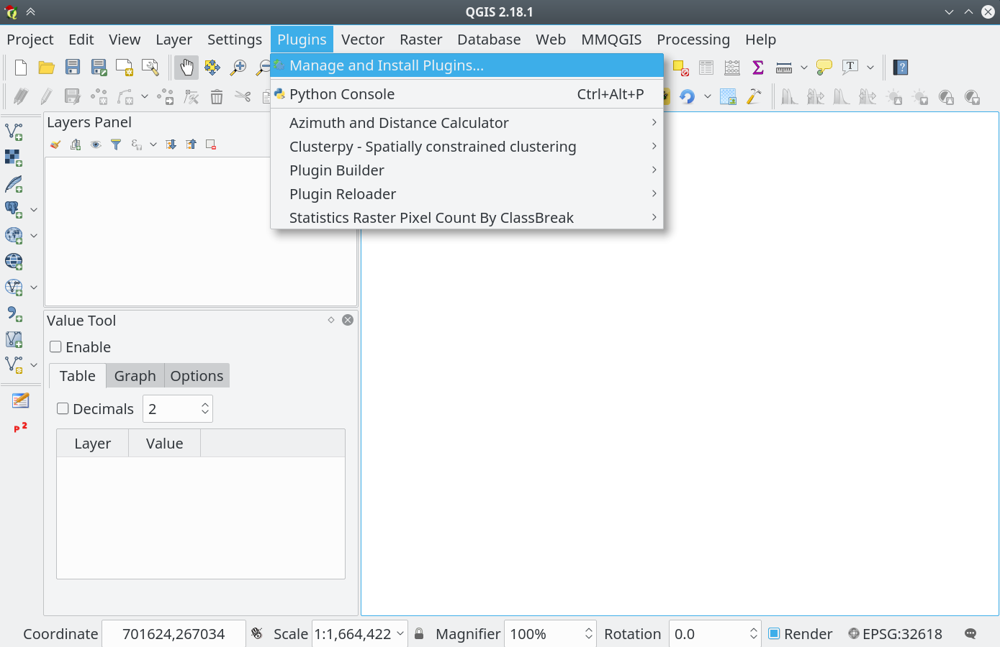

# Installation

The plugin can be installed using the QGIS Plugin Manager:

- Go into Qgis to `Plugins` menu and `Manage and install plugins`

    

- In `All` section search for `Cloud Masking` click and press Install plugin

    

- The plugin will be available in the `Plugins` menu and `Plugins toolbar`

    

### ESPA format version

The CloudMasking plugin support two ESPA version; the old and new version in different branch, by default the plugin in the Qgis repository is for the new ESPA version and install it as explained above.

!!! warning "For Old ESPA version"
    If you want masking for old ESPA version, this plugin continue developing in branch repository, then you need download from [here](https://drive.google.com/uc?export=download&id=0B2KQf7Dbx7DUZTFoMGY1dXFWTGc) and install it manually in Qgis. For install manually unpack in plugins qgis user directory:

    * windows: `C:\Users\<user>\.qgis2\python\plugins\` 
    * linux/mac: `/home/<user>/.qgis2/python/plugins/`
    
    Then restart Qgis and activate it in "Plugins" menu and "Manage and install plugins" in "Installed" items.

# Upgrade

For upgrade the plugin to a new version:

- Go into Qgis to `Plugins` menu and `Manage and install plugins` and click in `Upgradeable` _(if not exists this item is because there are not new versions for all plugins installed)_:

    

    !!! warning "Windows users"
        For some reason (with a dll library in the plugin, maybe a bug in Qgis) the update in windows has problems. To upgrade, follow these steps: first deactivated and close the plugin, restart Qgis, then uninstall the plugin or delete manually the plugin directory and finally install it.